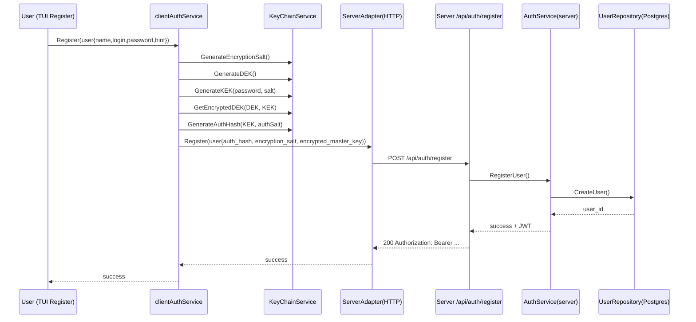
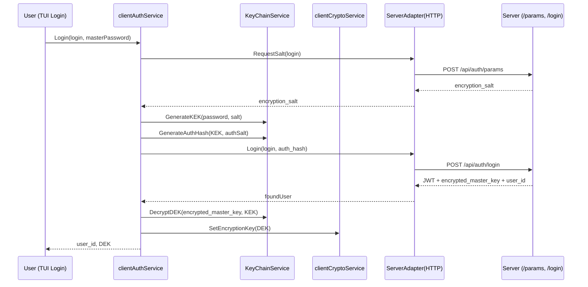
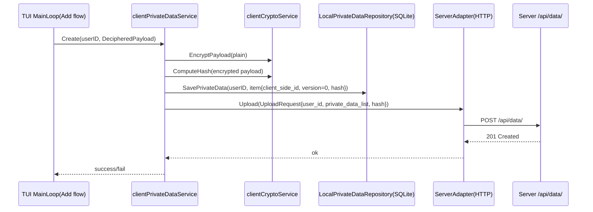
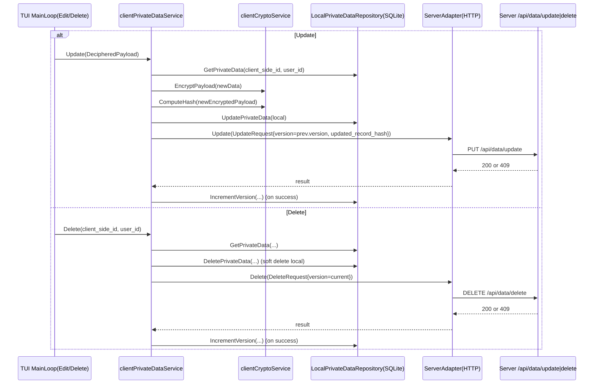
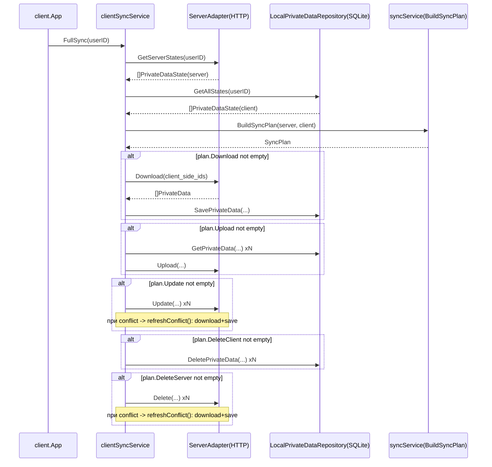
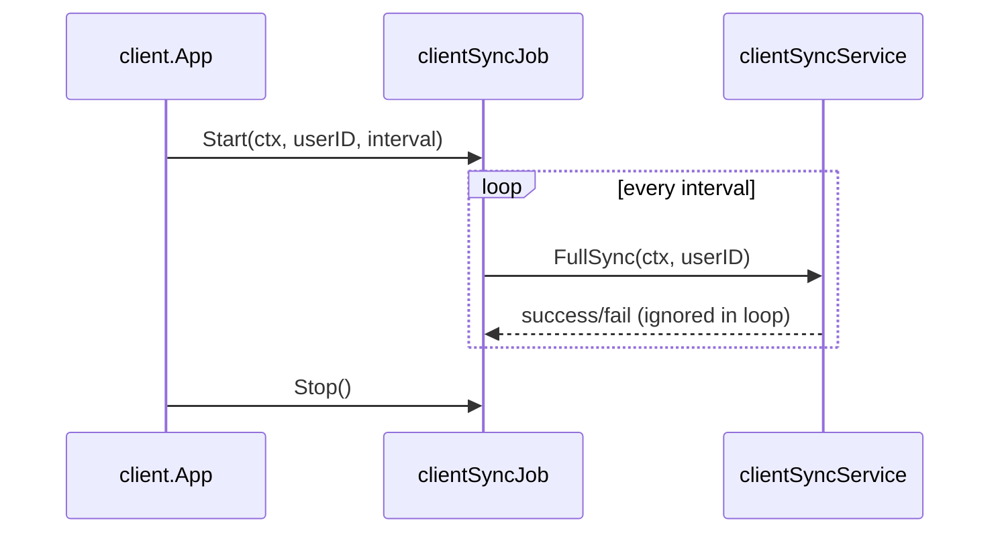

# GoPassKeeper — Summary

## 1) Технологический стек

| Слой | Что используется | Для чего |
|---|---|---|
| Язык/платформа | Go 1.26 | Основная бизнес-логика, конкурентность, переносимость |
| Client UI | Bubble Tea + Bubbles + Lipgloss | Терминальный интерфейс (TUI), роутинг экранов, hot keys |
| API (transport) | HTTP REST (chi) | Публичные API для auth/data/sync |
| Доп. transport | gRPC (каркас) | Расширяемость (в коде есть инфраструктура) |
| Клиент HTTP | resty | Удобный HTTP-клиент, таймауты, сериализация |
| БД сервера | PostgreSQL | Основное хранилище пользователей и зашифрованных записей |
| Локальная БД клиента | SQLite | Офлайн-слой, локальный кэш, основа sync |
| Миграции | goose | Версионирование схемы БД (server + sqlite) |
| Криптография | Argon2id + AES-GCM + HMAC-SHA256 | KDF/шифрование полезной нагрузки/контроль целостности |
| Аутентификация | JWT (HS256) | Сессия клиента и авторизация запросов |
| Логирование | zerolog | Структурированные логи и трассировка |
| Тесты | testify + sqlmock + gomock | Unit/integration tests и моки |

---

## 2) Модель хранения данных

### Сервер (PostgreSQL)
- `users`: `user_id`, `login`, `auth_hash`, `encryption_salt`, `encrypted_master_key`, ...
- `ciphers`: `user_id`, `client_side_id`, `type`, `metadata`, `data`, `notes`, `additional_fields`, `hash`, `version`, `deleted`, timestamps.
- `data_types`: справочник типов (`login_password`, `text`, `binary`, `bank_card`).

### Клиент (SQLite)
- Локально используется аналогичная модель `users/ciphers/data_types`.
- Основное назначение: быстрый локальный доступ + офлайн + синхронизация с сервером.

### Ключевые принципы модели
- `client_side_id` — стабильный идентификатор записи между устройствами.
- `version` — optimistic locking.
- `deleted` — soft delete (для корректной синхронизации удаления).
- `hash` — контроль изменения payload без полной расшифровки.

---

## 3) Безопасность данных (двухуровневая, Bitwarden-подобная)

## Уровень 1: Доступ к аккаунту
- На клиенте:
  - генерируется `salt`,
  - из `master password + salt` выводится `KEK` (Argon2id),
  - вычисляется `AuthHash`,
  - генерируется `DEK`.
- `DEK` шифруется `KEK` -> `encrypted_master_key`.
- На сервер отправляются: `auth_hash`, `encryption_salt`, `encrypted_master_key`.
- Пароль в открытом виде не хранится/не используется для шифрования на сервере.

## Уровень 2: Шифрование данных vault
- Все чувствительные поля (`metadata`, `data`, `notes`, `additional_fields`) шифруются на клиенте `DEK` через AES-GCM.
- Сервер хранит только ciphertext и служебные поля (`type`, `version`, `hash`, `deleted`).
- После логина клиент расшифровывает `DEK` локально и только тогда может читать/изменять записи.

## Целостность и защита API
- Для upload/update клиент добавляет transport-hash (HMAC-SHA256 от payload), сервер проверяет его middleware-слоем.
- Для операций update/delete используется optimistic locking по `version`.
- При расхождении версий сервер возвращает conflict.

---

## 4) Валидация, аутентификация, авторизация

## Валидация
- **UI/TUI**: первичная валидация обязательных полей и UX-ограничения (например, поля карты).
- **Server service middleware**: `privateDataValidationService` проверяет структуру запросов, наличие полей, корректность `version/hash/type` и согласованность `user_id`.
- **Domain validator**: `internal/validators` валидирует `UploadRequest/UpdateRequest/DeleteRequest/DownloadRequest` и вложенные структуры.

## Аутентификация
- Login flow:
  1. Клиент запрашивает `encryption_salt` (`/api/auth/params`),
  2. Вычисляет `KEK` и `AuthHash`,
  3. Отправляет login + `AuthHash` (`/api/auth/login`),
  4. Получает JWT + `encrypted_master_key`,
  5. Локально расшифровывает `DEK`.

## Авторизация
- JWT Bearer в заголовке `Authorization`.
- Middleware `auth` валидирует токен и кладет `user_id` в context.
- Все data/sync операции дополнительно сверяют `request.user_id` с `user_id` из токена.

---

## 5) Синхронизация данных

Используется state-based sync по `client_side_id + version + hash + deleted`.

Категории плана:
- `Download`
- `Upload`
- `Update`
- `DeleteClient`
- `DeleteServer`

Ключевые свойства:
- Soft delete вместо физического удаления.
- Версионность защищает от перезаписи чужих изменений.
- При конфликте update/delete клиент может подтянуть актуальную запись с сервера (`refreshConflict`).

---

## 6) Sequence diagrams (client-side)

### 6.1 Регистрация (`ClientServices.AuthService.Register`)

### 6.2 Вход (`ClientServices.AuthService.Login`)

### 6.3 Создание записи (`ClientServices.PrivateDataService.Create`)

### 6.4 Изменение/удаление записи (`Update` / `Delete`)

### 6.5 Полная синхронизация (`ClientServices.SyncService.FullSync`)

### 6.6 Фоновая синхронизация (`ClientServices.SyncJob`)

---

## 7) Что важно учитывать

- Текущий production-канал взаимодействия клиента с сервером — HTTP.
- Endpoints `/api/auth/settings/*` (смена пароля/OTP) пока заглушки (`501 Not Implemented`).
- Основа UX клиента: локальная работа с SQLite + периодическая и ручная синхронизация.
